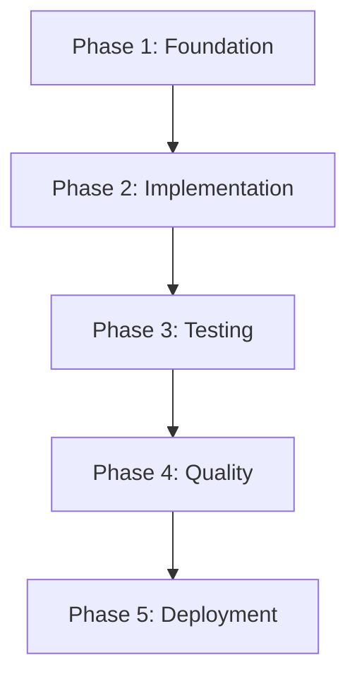

# Discordeno Migration: PMAT-Enforced Todo List

## Meta Configuration
```yaml
version: 1.0.0
methodology: PMAT
temperature: 0.0
deterministic: true
quality_threshold: 85
coverage_requirement: 80
complexity_limit: 10
```

## Quality Gates (PMAT)
- [ ] Zero linting errors
- [ ] 80% test coverage minimum
- [ ] Cyclomatic complexity < 10
- [ ] No self-admitted technical debt (SATD)
- [ ] Full TypeScript type safety
- [ ] Zero runtime dependencies issues

## Phase 1: Foundation Setup [Priority: Critical]

### Task 1.1: Update Dependencies
- [ ] `DEP-001`: Remove Harmony from deps.ts
- [ ] `DEP-002`: Add Discordeno import with version pinning
- [ ] `DEP-003`: Validate all Deno std library imports
- [ ] `DEP-004`: Remove unused dependencies
- [ ] `DEP-005`: Create type exports for Discordeno

### Task 1.2: Configuration
- [ ] `CFG-001`: Update deno.json imports map for Discordeno
- [ ] `CFG-002`: Configure PMAT quality thresholds
- [ ] `CFG-003`: Set deterministic build settings
- [ ] `CFG-004`: Configure test coverage requirements
- [ ] `CFG-005`: Update Makefile targets for new structure

## Phase 2: Bot Implementation [Priority: High]

### Task 2.1: Week 1 Basic Bot
- [ ] `W1-001`: Import Discordeno createBot function
- [ ] `W1-002`: Convert Client to createBot pattern
- [ ] `W1-003`: Implement message event handler
- [ ] `W1-004`: Convert command parsing to Discordeno format
- [ ] `W1-005`: Implement ping command
- [ ] `W1-006`: Implement echo command
- [ ] `W1-007`: Implement help command
- [ ] `W1-008`: Add error handling with proper types
- [ ] `W1-009`: Implement graceful shutdown
- [ ] `W1-010`: Add comprehensive logging

### Task 2.2: Week 3 Conversational Bot
- [ ] `W3-001`: Create conversation state manager
- [ ] `W3-002`: Implement flow detection system
- [ ] `W3-003`: Build state persistence layer
- [ ] `W3-004`: Create conversation context tracking
- [ ] `W3-005`: Implement session timeout management
- [ ] `W3-006`: Add prompt interpolation system
- [ ] `W3-007`: Create transition matching engine
- [ ] `W3-008`: Implement conversation cleanup
- [ ] `W3-009`: Add conversation history tracking
- [ ] `W3-010`: Create flow registration system

### Task 2.3: Week 5 MCP Integration
- [ ] `W5-001`: Design MCP client interface
- [ ] `W5-002`: Implement JSON-RPC communication
- [ ] `W5-003`: Create tool registration system
- [ ] `W5-004`: Build request/response handling
- [ ] `W5-005`: Implement AI context management
- [ ] `W5-006`: Add prompt optimization
- [ ] `W5-007`: Create fallback responses
- [ ] `W5-008`: Implement cost tracking
- [ ] `W5-009`: Add safety validations
- [ ] `W5-010`: Create monitoring dashboard

## Phase 3: Testing [Priority: High]

### Task 3.1: Unit Tests
- [ ] `TEST-001`: Create test utilities for Discordeno
- [ ] `TEST-002`: Write command parsing tests
- [ ] `TEST-003`: Write message validation tests
- [ ] `TEST-004`: Write conversation flow tests
- [ ] `TEST-005`: Write state management tests
- [ ] `TEST-006`: Write session expiry tests
- [ ] `TEST-007`: Write prompt interpolation tests
- [ ] `TEST-008`: Write MCP communication tests
- [ ] `TEST-009`: Achieve 80% code coverage
- [ ] `TEST-010`: Validate all edge cases

### Task 3.2: Integration Tests
- [ ] `INT-001`: Test bot startup and shutdown
- [ ] `INT-002`: Test command execution flow
- [ ] `INT-003`: Test conversation persistence
- [ ] `INT-004`: Test error recovery
- [ ] `INT-005`: Test rate limiting

## Phase 4: Quality Assurance [Priority: Critical]

### Task 4.1: PMAT Validation
- [ ] `QA-001`: Run deno fmt --check
- [ ] `QA-002`: Run deno lint with zero errors
- [ ] `QA-003`: Run type checking with strict mode
- [ ] `QA-004`: Measure cyclomatic complexity
- [ ] `QA-005`: Scan for SATD comments
- [ ] `QA-006`: Validate test coverage >= 80%
- [ ] `QA-007`: Check for security vulnerabilities
- [ ] `QA-008`: Validate error handling completeness

### Task 4.2: Documentation
- [ ] `DOC-001`: Update README for Discordeno
- [ ] `DOC-002`: Document API changes
- [ ] `DOC-003`: Create migration guide
- [ ] `DOC-004`: Update course materials
- [ ] `DOC-005`: Add troubleshooting guide

## Phase 5: Deployment [Priority: Medium]

### Task 5.1: Build & Deploy
- [ ] `DPL-001`: Test deno compile
- [ ] `DPL-002`: Optimize bundle size
- [ ] `DPL-003`: Configure Deno Deploy
- [ ] `DPL-004`: Set up GitHub Actions
- [ ] `DPL-005`: Create release artifacts

## Success Criteria

### Functional Requirements
- ✅ All three bot examples working with Discordeno
- ✅ Commands respond within 100ms
- ✅ Conversation state persists correctly
- ✅ MCP integration functional

### Non-Functional Requirements
- ✅ TDG Score >= 85%
- ✅ Test Coverage >= 80%
- ✅ Zero linting errors
- ✅ Cyclomatic Complexity < 10
- ✅ Build time < 30 seconds
- ✅ Bundle size < 5MB

## Risk Mitigation

### Technical Risks
| Risk | Mitigation |
|------|-----------|
| Discordeno API differences | Create abstraction layer |
| Test coverage challenges | Use dependency injection |
| Performance degradation | Implement caching layer |
| Type incompatibilities | Create type adapters |

### Schedule Risks
| Risk | Mitigation |
|------|-----------|
| Complexity underestimation | Add 20% buffer to estimates |
| Dependency issues | Pin all versions |
| Testing delays | Parallel test execution |

## Execution Order (Deterministic)



## Time Estimates

| Phase | Tasks | Hours | Complexity |
|-------|-------|-------|------------|
| Phase 1 | 10 | 8 | Medium |
| Phase 2 | 30 | 24 | High |
| Phase 3 | 15 | 12 | Medium |
| Phase 4 | 8 | 6 | Low |
| Phase 5 | 5 | 4 | Low |
| **Total** | **68** | **54** | **Medium-High** |

## Validation Checklist

- [ ] All tasks have clear acceptance criteria
- [ ] Each task starts with an action verb
- [ ] Dependencies are explicitly defined
- [ ] Time estimates are realistic
- [ ] Quality gates are measurable
- [ ] PMAT standards enforced throughout
- [ ] No ambiguous requirements
- [ ] All edge cases covered

---
*Generated with PMAT v1.0 | Temperature: 0.0 | Deterministic: true*